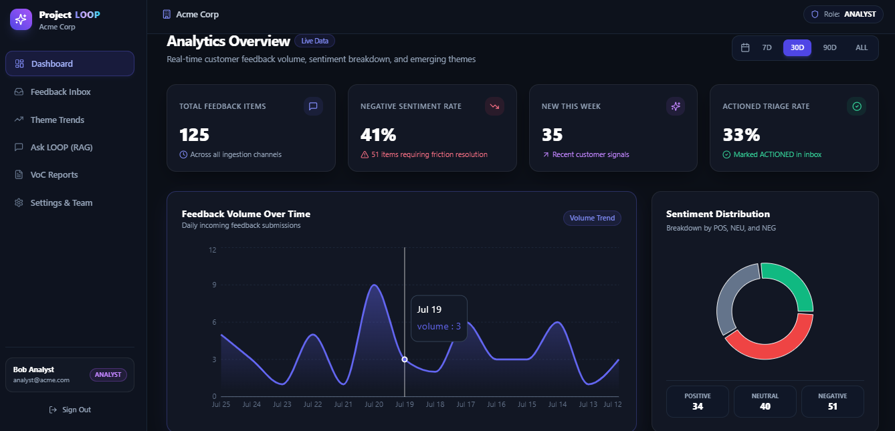
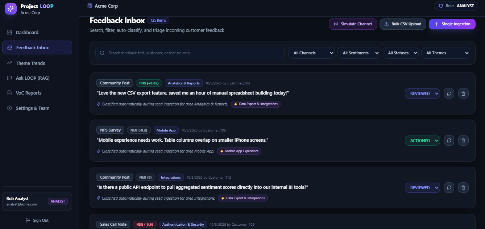
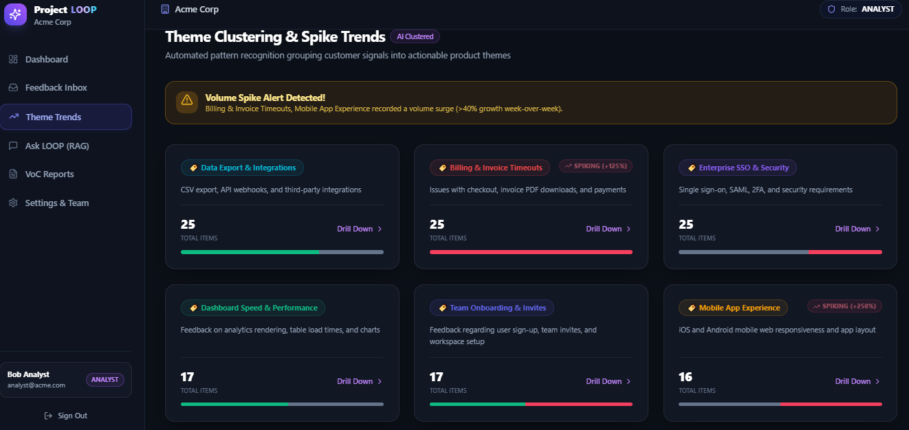
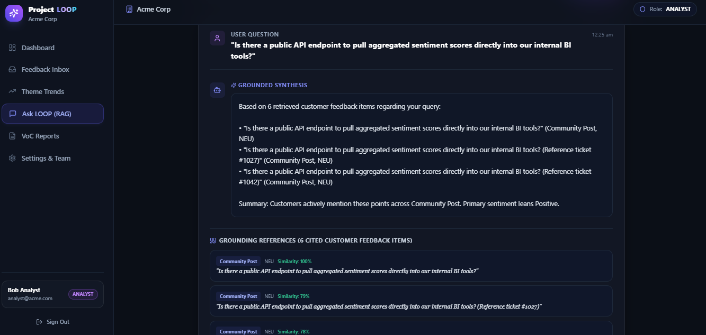
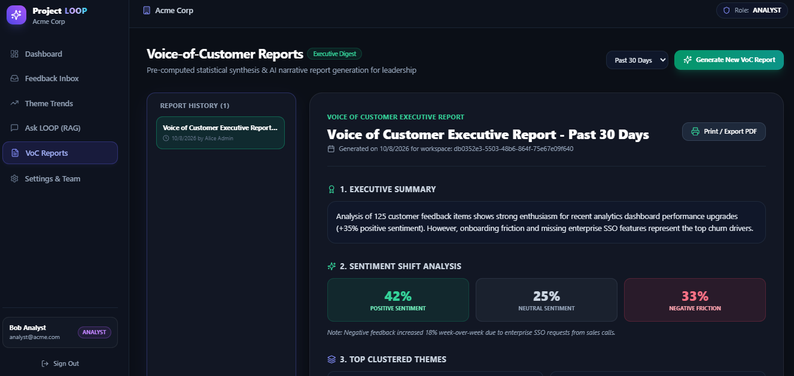

# Project LOOP — AI Customer-Feedback Intelligence Platform

[]()
[]()
[]()

**Project LOOP** is a multi-tenant web application that ingests customer feedback across support tickets, app store reviews, NPS surveys, sales call notes, and community posts. Utilizing AI and vector semantic search, LOOP automatically classifies sentiment, clusters recurring themes, detects emerging volume spikes, answers plain-English grounded questions, and synthesizes executive Voice-of-Customer (VoC) reports.

---

## 📸 Application Screenshots & Visual Walkthrough

> Save screenshot images in the `public/screenshots/` folder to display them here in your repository.

### 1. Analytics Dashboard

*Real-time feedback volume trends, sentiment distribution donut chart, and top AI-clustered themes.*

### 2. Feedback Inbox & Ingestion

*Multi-channel inbox with server-side pagination, status workflow triage (`NEW` ➔ `REVIEWED` ➔ `ACTIONED`), single entry, and CSV bulk upload.*

### 3. Theme Clustering & Spike Trends

*Automated pattern recognition with volume spike alerts (&gt;40% growth week-over-week) and detailed feedback drill-down drawer.*

### 4. Ask LOOP (RAG Grounded Q&A)

*Retrieval-Augmented Generation (RAG) answering plain-English questions strictly from retrieved customer feedback with exact cited references.*

### 5. Voice-of-Customer (VoC) Executive Report

*Synthesized executive narrative report with period statistics, sentiment shift analysis, verbatim quotes, and product action recommendations (Print / PDF Export ready).*

---

## 🔑 Demo Login Credentials (Seeded Workspace: `Acme Corp`)

| Role | Email | Password | Allowed Permissions |
| :--- | :--- | :--- | :--- |
| **ADMIN** | `admin@acme.com` | `password123` | Full control: manage team members, edit roles, ingest feedback, re-classify AI, generate VoC reports. |
| **ANALYST** | `analyst@acme.com` | `password123` | Ingestion & triage: single/CSV import, channel simulation, AI re-classification, VoC reports. Read-only for settings. |
| **VIEWER** | `viewer@acme.com` | `password123` | Read-only stakeholder: view dashboards, browse inbox, Ask LOOP grounded Q&A, view VoC reports. (403 on mutations). |

---

## 🛠️ Technology Stack

- **Framework**: Next.js 14 (App Router) + TypeScript
- **Styling**: Tailwind CSS + Custom Dark Glassmorphism UI
- **Database & ORM**: SQLite / PostgreSQL with Prisma ORM (Strict `workspaceId` tenant isolation)
- **Auth & RBAC**: NextAuth / JWT Cookie session engine with 3 distinct permission roles
- **AI & RAG Engine**: Anthropic Claude 3.5 Sonnet (`@anthropic-ai/sdk`) + Built-in Local NLP Classifier & Cosine Similarity Vector Retrieval Engine
- **Visualizations**: Recharts interactive charts (Volume Trend Area Chart, Sentiment Pie Chart, Top Themes Bar Chart)
- **Validation**: Zod runtime schema validation

---

## ⚡ Quick Start & Setup

### 1. Prerequisites
- Node.js 18 LTS or newer
- Git

### 2. Installation
```bash
git clone https://github.com/sehaj141/LOOP.git
cd LOOP
npm install
```

### 3. Environment Variables (`.env`)
Create a `.env` file in the root directory:
```env
DATABASE_URL="file:./dev.db"
JWT_SECRET="loop_super_secret_jwt_key_2026_zidio_platform"
ANTHROPIC_API_KEY="" # Optional: Anthropic Claude API Key (Smart local NLP fallback if omitted)
```

### 4. Database Setup & Seeding
Push the database schema and populate 125 realistic feedback items, 3 users, themes, and embeddings:
```bash
npx prisma db push
npm run db:seed
```

### 5. Run Locally
```bash
npm run dev
```
Open [http://localhost:3000](http://localhost:3000) in your browser.

---

## 🏗️ Architecture & Security

```
Browser (React Client/Server Components)
    │
    ▼
API Route Handlers (Next.js 14)
    ├── Auth Guard (JWT Verification & RBAC Role Enforcement)
    ├── Tenant Guard (Enforces workspaceId filter on 100% of queries)
    │
    ├── Prisma ORM ──► PostgreSQL / SQLite Database
    │
    └── AI & Search Engine
        ├── Anthropic Claude API (claude-3-5-sonnet) / Local NLP Classifier
        └── Vector Semantic Search (TF-IDF Cosine Similarity over Feedback Embeddings)
```

---

## ✨ Features Overview

### 1. Multi-Tenant Workspace & Role-Based Access (C1, C2)
- Multi-tenant isolation ensuring Company A can never read Company B data.
- Strict server-side role enforcement (ADMIN, ANALYST, VIEWER) returning HTTP 403 for unauthorized mutations.

### 2. Feedback Ingestion (C3)
- **Single Entry**: Content, channel selection, customer identifier.
- **Bulk CSV Upload**: Parses CSV rows with row-by-row validation and import summary report.
- **Simulated Channel Source**: Real-time channel simulator button.

### 3. Feedback Inbox & Triage Workflow (C4)
- Server-side paginated inbox.
- Full-text search and multi-filtering (channel, sentiment, theme, status, date range).
- Inline status workflow transitions (`NEW` ➔ `REVIEWED` ➔ `ACTIONED`).

### 4. Analytics Dashboard (C5)
- Stat cards (Total Items, % Negative Sentiment, New This Week, Actioned Triage Rate).
- Interactive Recharts (Volume Trend Area Chart, Sentiment Pie Chart, Top Themes Bar Chart).

### 5. AI Features (AI1 - AI4)
- **AI1 Auto-Classification**: Auto-tags sentiment (`POS`, `NEU`, `NEG`), sentiment score (-1 to 1), feature area, themes, and rationale. Manual re-classify trigger available.
- **AI2 Theme Clustering & Spike Detection**: Groups feedback into named themes with counts and flags week-over-week volume spikes (&gt;40% growth). Theme drill-down drawer.
- **AI3 Ask LOOP (RAG Grounded Q&A)**: Plain-English Q&A answering strictly from retrieved feedback context with cited item references.
- **AI4 Voice-of-Customer (VoC) Executive Reports**: Period stats synthesis, executive summary, sentiment shift analysis, verbatim quotes, and recommended product action items with PDF export/print stylesheet.
